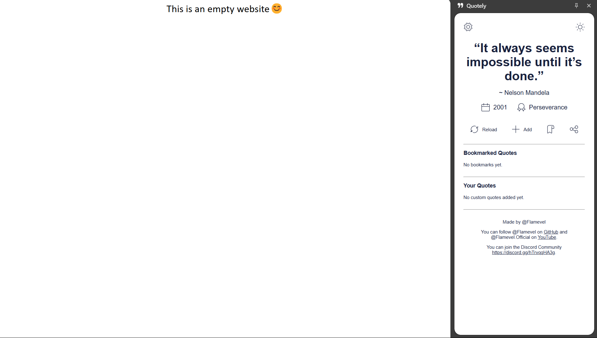
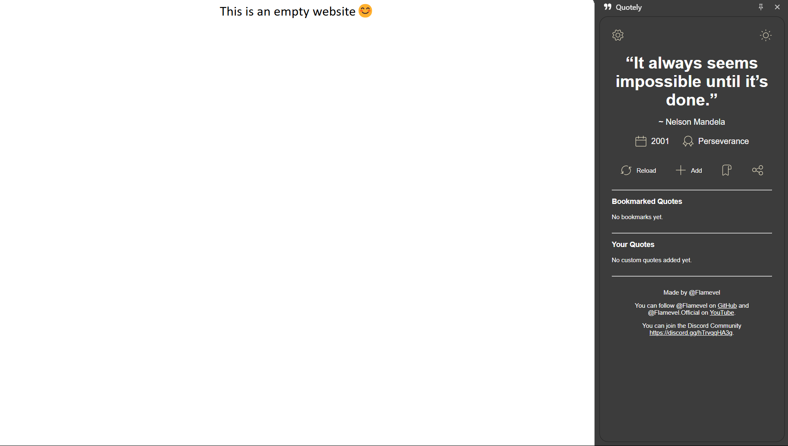

#  Quotely - A Extension

💬 **Quotely** delivers daily inspiration right to your side panel. With a sleek modern interface, dark mode, and local quote storage, it makes saving and bookmarking your favorite quotes easy. Designed for clarity, personalization, and simplicity, Quotely is your lightweight companion for daily motivation.

## 📜 Table of Contents
<details>
<summary><strong>Table of Contents 📜</strong></summary>

- [✨ Features](#-features)
- [📸 Screenshots](#-screenshots)
- [🌐 Browser Support](#-browser-support)
- [📥 Installation](#-installation)
- [📝 Usage](#-usage)
- [🚀 Language Support](#-language-support)
- [🤝 Contributing](#-contributing)
- [🤔 FAQ](#-faq)
- [💬 Feedback](#-feedback)
- [👥 Community](#-community)
- [⚠️ Other](#-other)
- [🛠️ License](#-license)

</details>

## ✨ Features
- 💬 **Dynamic Quotes**: Get a fresh quote each time with author, category & year.
- 🔖 **Bookmark Favorites**: Save your favorite quotes locally.
- ➕ **Add Your Own**: Easily create and view your custom quotes.
- 🗑️ **Manage**: Delete bookmarks or custom quotes anytime.
- 🌒 **Dark Mode**: Switch themes with a single click.
- ⚙️ **Settings**: Central place for future features.
- 📤 **Share Quotes**: Copy quotes and share them via social media.
- 📚 **Organized Metadata**: View year, source, and more.
- 🎨 **Beautiful Design**: A clean design and smooth layout.

## 📸 Screenshots
| Light Mode | Dark Mode |
|------------|-----------|
|  |  |

_**Note**: You can find the screenshot files in the `/assets/screenshots` folder._

## 🌐 Browser Support

| Browser | Support | Notes |
|--------|--------|-------|
| **Chrome** | ✅ Full Support | No further notes. |
| **Edge** | ✅ Full Support | No further notes. |

ℹ️ **Quotely is built and optimized for Google Chrome**. Other browsers may not provide full functionality due to missing or experimental API support.

## 📥 Installation
1. Clone this repository:
   ```sh
   git clone https://github.com/flamevel/quotely.git
   ```
2. Open Chrome and go to `chrome://extensions/`.
3. Enable **Developer mode** (top right corner).
4. Click **Load unpacked** and select the `QuotelyExtension` project folder.

## 📝 Usage
- Click the **side panel icon** to open Quotely
- Use the top icons to switch theme or open settings
- Click **reload** to get a new quote
- Add your own quotes via the **add** button
- Save favorites with the **bookmark** icon and share them via the **share** icon
- All data is stored locally (bookmarks, theme, etc.)

## 🚀 Language Support
Currently supports only **English**, internationalization is planned.  

## 🤝 Contributing
Contributions are welcome! Feel free to fork this repository and submit pull requests for improvements.

## 🤔 FAQ 
**Q: Can I request new features?**  
A: Absolutely! Open an issue on GitHub with your request or join our community.

**Q: Where are my bookmarks stored?**  
A: All data is saved locally using `chrome.storage.local`.

**Q: Where can I find the qoutes?**  
A: You can find the quotes in `src/data/quotes.json`.

## 💬 Feedback
Have suggestions or found a bug? Open an issue on [GitHub](https://github.com/flamevel/quotely/issues).

## 👥 Community
Join our community on Discord to discuss features, report issues, and get support or find more:

<div align="left">
  <a href="https://discord.gg/hTrvqqHA3g"></a>
  <a href="https://youtube.com/@flamevel.official?si=R0VRAETqwqHKIfWJ"></a>
  <a href="https://github.com/Flamevel"></a>
</div>

## ⚠️ Other
> [!NOTE]  
> Please note this extension is still in development and may contain bugs.

> [!IMPORTANT]  
> If you like this project, consider ⭐ **starring** the repository.

## 🛠️ License
This project is licensed under the **Creative Commons Attribution-NonCommercial-ShareAlike 4.0 International (CC BY-NC-SA 4.0)** License.  
See the [LICENSE](LICENSE) file for details.